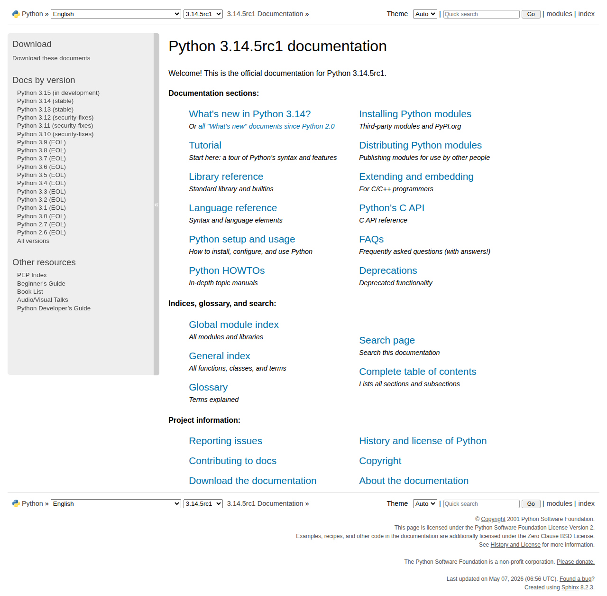

# Visited: https://docs.python.org/
**Time:** Thu May  7 18:19:32 UTC 2026

## Screenshot

## Raw HTML
[page.html](./page.html)

## Downloaded Media (0 files)
_No media files downloaded_

## Other Links
- [#](#)
- [/bugs.html](/bugs.html)
- [/license.html](/license.html)
- [_static/classic.css?v=234b1a7c](_static/classic.css?v=234b1a7c)
- [_static/copybutton.js](_static/copybutton.js)
- [_static/doctools.js?v=9bcbadda](_static/doctools.js?v=9bcbadda)
- [_static/documentation_options.js?v=bf826059](_static/documentation_options.js?v=bf826059)
- [_static/menu.js](_static/menu.js)
- [_static/opensearch.xml](_static/opensearch.xml)
- [_static/pydoctheme.css?v=4365c8fe](_static/pydoctheme.css?v=4365c8fe)
- [_static/pydoctheme_dark.css](_static/pydoctheme_dark.css)
- [_static/pygments.css?v=b86133f3](_static/pygments.css?v=b86133f3)
- [_static/pygments_dark.css?v=5349f25f](_static/pygments_dark.css?v=5349f25f)
- [_static/rtd_switcher.js](_static/rtd_switcher.js)
- [_static/search-focus.js](_static/search-focus.js)
- [_static/sidebar.js](_static/sidebar.js)
- [_static/sphinx_highlight.js?v=dc90522c](_static/sphinx_highlight.js?v=dc90522c)
- [_static/switchers.js](_static/switchers.js)
- [_static/themetoggle.js](_static/themetoggle.js)
- [about.html](about.html)
- [bugs.html](bugs.html)
- [c-api/index.html](c-api/index.html)
- [contents.html](contents.html)
- [copyright.html](copyright.html)
- [deprecations/index.html](deprecations/index.html)
- [distributing/index.html](distributing/index.html)
- [download.html](download.html)
- [extending/index.html](extending/index.html)
- [faq/index.html](faq/index.html)
- [genindex.html](genindex.html)
- [glossary.html](glossary.html)
- [howto/index.html](howto/index.html)
- [https://analytics.python.org/js/script.file-downloads.outbound-links.js](https://analytics.python.org/js/script.file-downloads.outbound-links.js)
- [https://devguide.python.org/](https://devguide.python.org/)
- [https://devguide.python.org/documentation/help-documenting/](https://devguide.python.org/documentation/help-documenting/)
- [https://docs.python.org/2.6/](https://docs.python.org/2.6/)
- [https://docs.python.org/2.7/](https://docs.python.org/2.7/)
- [https://docs.python.org/3.0/](https://docs.python.org/3.0/)
- [https://docs.python.org/3.1/](https://docs.python.org/3.1/)
- [https://docs.python.org/3.10/](https://docs.python.org/3.10/)
- [https://docs.python.org/3.11/](https://docs.python.org/3.11/)
- [https://docs.python.org/3.12/](https://docs.python.org/3.12/)
- [https://docs.python.org/3.13/](https://docs.python.org/3.13/)
- [https://docs.python.org/3.14/](https://docs.python.org/3.14/)
- [https://docs.python.org/3.15/](https://docs.python.org/3.15/)
- [https://docs.python.org/3.2/](https://docs.python.org/3.2/)
- [https://docs.python.org/3.3/](https://docs.python.org/3.3/)
- [https://docs.python.org/3.4/](https://docs.python.org/3.4/)
- [https://docs.python.org/3.5/](https://docs.python.org/3.5/)
- [https://docs.python.org/3.6/](https://docs.python.org/3.6/)

## Stats
- Links: 73
- Media: 0
